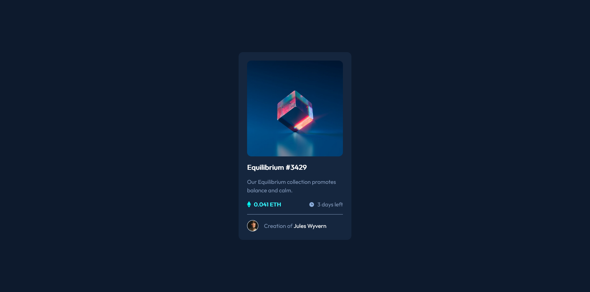

# Frontend Mentor - NFT preview card component solution

This is a solution to the [NFT preview card component challenge on Frontend Mentor](https://www.frontendmentor.io/challenges/nft-preview-card-component-SbdUL_w0U). 

### Screenshot

### Built with

- HTML
- CSS
- Flexbox

### What I learned

I got a much needed refresher on positioning in CSS!

### Useful resources

- [The Net Ninja (Youtube)](https://www.youtube.com/watch?v=2JMGG_8T-vY&list=RDCMUCW5YeuERMmlnqo4oq8vwUpg&start_radio=1&rv=2JMGG_8T-vY&t=279) - This YouYuber is very easy to understand and helped a lot with positioning the elements. 

## Author

- Frontend Mentor - [@Beefsupreme21](https://www.frontendmentor.io/profile/Beefsupreme21)
